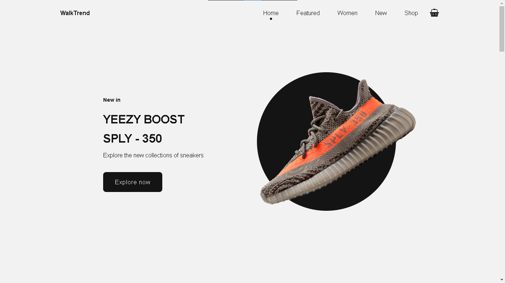
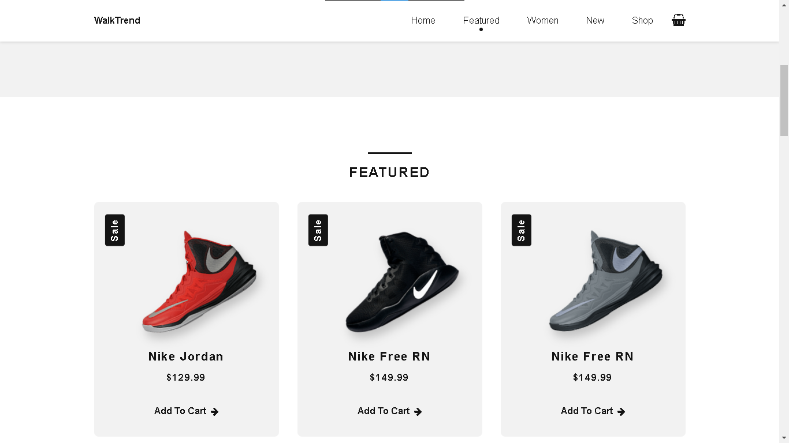
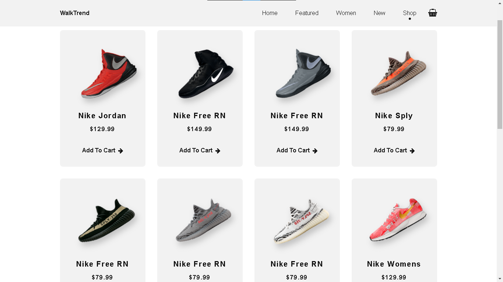

# WalkTrand

🎉 **Welcome to WalkTrand** - Your go-to online store for the latest trends in shoes and clothing! 👟👗  
WalkTrand combines style and comfort to deliver the best shopping experience.

  
*(Add an image showcasing your website’s main interface)*

---

## 🌟 Features

- **Wide Variety**: A diverse collection of shoes and clothing for all ages and styles.  
- **Responsive Design**: Optimized for both desktop and mobile users.  
- **Easy Navigation**: Smooth and user-friendly interface.  
- **Secure Checkout**: Your payment information is always safe.  

---

## 📸 Screenshots

### Home Page  
  

### Product Page  
  


---

## 📹 Demo Video

🎥 [Click here to watch the demo video](https://your-video-link-here.com)  
*(Upload a video showcasing your website’s functionality to YouTube or any other platform and add the link here)*

---

## 🛠️ Installation

To run this project locally, follow these steps:

1. Clone the repository:
   ```bash
   git clone https://github.com/username/WalkTrand.git
   ```
2. Navigate to the project directory:
   ```bash
   cd WalkTrand
   ```
3. Open the `index.html` file in your browser:
   ```bash
   open index.html
   ```

*(This project is built using HTML, CSS, and JavaScript, so no additional setup is required)*

---

## 🌐 Live Demo

🚀 Check out the live version of WalkTrand: [WalkTrand Live](https://lechehebdjaafar.github.io/WalkTrend/)  

---

## 📞 Contact Me

Feel free to reach out for any questions or feedback:
 
- **Instagram**: [@CodeCraftDL](https://instagram.com/ddos_attack_co)  
- **Youtube**: [Youtube.com](https://youtube.com/@codecraftdl)  

---

## 🤝 Contributing

Contributions are always welcome!  
If you'd like to contribute, please fork the repository and submit a pull request.

---

## 📜 License

This project is licensed under the [MIT License](https://opensource.org/licenses/MIT).  

---

## 🙌 Acknowledgements

Special thanks to everyone who supported the creation of WalkTrand! 🎉

